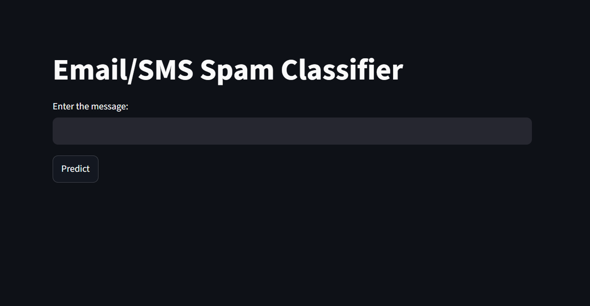
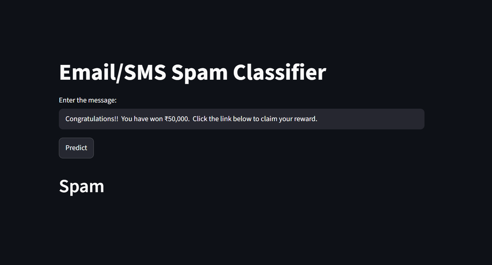
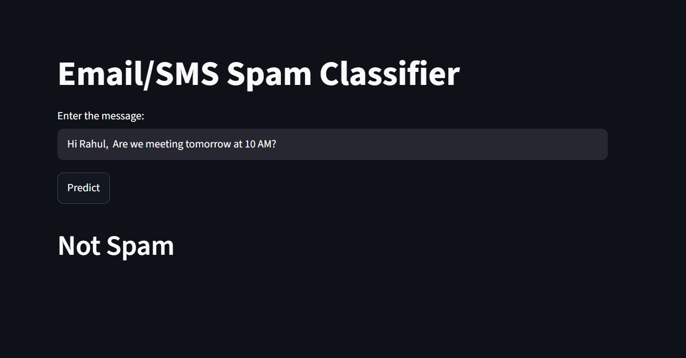

# 📧 Email/SMS Spam Classifier

An intelligent **Machine Learning** application that classifies incoming **Email and SMS messages** as **Spam** or **Not Spam** using **Natural Language Processing (NLP)** and the **Multinomial Naive Bayes** algorithm.

The application is built with **Python**, **Scikit-learn**, **NLTK**, and **Streamlit**, providing an easy-to-use web interface for real-time spam detection.

---

## 🚀 Live Demo

🔗 **Live Application:** _(Add your Streamlit deployment link here)_

Example:

```
https://your-app-name.streamlit.app
```

---

## 📌 Features

- 📩 Detects Spam and Ham (Not Spam) messages
- 🧹 Text preprocessing using NLP techniques
- 🔤 Converts text to lowercase
- ✂️ Tokenization using NLTK
- 🚫 Removes stopwords
- 🔠 Removes punctuation and special characters
- 🌱 Applies Porter Stemming
- 📊 TF-IDF Vectorization
- 🤖 Multinomial Naive Bayes Classifier
- 💻 Interactive Streamlit Web Application
- ⚡ Fast real-time prediction

---

## 🛠️ Technologies Used

### Programming Language

- Python 3.x

### Machine Learning

- Scikit-learn

### Natural Language Processing

- NLTK

### Data Manipulation

- Pandas
- NumPy

### Visualization

- Matplotlib
- Seaborn
- WordCloud

### Deployment

- Streamlit

---

## 📂 Project Structure

```
Email_Classifier/
│
├── app.py                  # Streamlit application
├── spam_detection.ipynb    # Model training notebook
├── spam.csv                # Dataset
├── vectorizer.pkl          # Saved TF-IDF Vectorizer
├── model.pkl               # Trained Machine Learning Model
├── requirements.txt
├── README.md
```

---

## 📊 Machine Learning Pipeline

```
Input Message
      │
      ▼
Text Preprocessing
      │
      ▼
Lowercase Conversion
      │
      ▼
Tokenization
      │
      ▼
Remove Punctuation
      │
      ▼
Remove Stopwords
      │
      ▼
Stemming
      │
      ▼
TF-IDF Vectorization
      │
      ▼
Multinomial Naive Bayes
      │
      ▼
Prediction
      │
      ▼
Spam / Not Spam
```

---

## 📚 Text Preprocessing

The input message undergoes several preprocessing steps:

- Convert text to lowercase
- Tokenize the sentence
- Remove punctuation
- Remove special characters
- Remove English stopwords
- Apply Porter Stemming
- Transform text using TF-IDF Vectorizer

---

## 🤖 Machine Learning Model

Algorithm Used:

- **Multinomial Naive Bayes**

Feature Extraction:

- **TF-IDF Vectorizer**

Dataset:

- SMS Spam Collection Dataset

---

## 📈 Exploratory Data Analysis

The project includes:

- Class Distribution
- Word Frequency Analysis
- WordCloud for Spam Messages
- WordCloud for Ham Messages
- Most Frequent Spam Words
- Most Frequent Ham Words

---

## 💻 Installation

### Clone the Repository

```bash
git clone https://github.com/Ishwar-gupta/SMS-spam-classifier.git
```

Move into the project directory

```bash
cd Email_Classifier
```

---

### Create Virtual Environment

Windows

```bash
python -m venv .venv
```

Activate

```bash
.venv\Scripts\activate
```

---

### Install Dependencies

```bash
pip install -r requirements.txt
```

---

## ▶️ Run the Application

```bash
streamlit run app.py
```

The application will open automatically in your browser.

If not, visit

```
http://localhost:8501
```

---

## 🧪 Example

### Input

```
Congratulations!!

You have won ₹50,000.

Click the link below to claim your reward.
```

### Output

```
Spam
```

---

### Input

```
Hi Rahul,

Are we meeting tomorrow at 10 AM?
```

### Output

```
Not Spam
```

---

## 📦 Python Libraries

```
streamlit
pandas
numpy
matplotlib
seaborn
wordcloud
scikit-learn
nltk
pickle
```

---

## 📷 Screenshots

### Home Page



---

### Spam Prediction



---

### Not Spam Prediction



---

## 📌 Future Improvements

- Deep Learning (LSTM / GRU)
- BERT-based Spam Detection
- Email Attachment Analysis
- URL Detection
- Multi-language Spam Detection
- User Authentication
- Spam Probability Score
- REST API using FastAPI
- Docker Deployment

---

## 👨‍💻 Author

**Siddheshwar Gupta**

B.Sc. CSIT Student

GitHub:
https://github.com/Ishwar-gupta

LinkedIn:
_[www.linkedin.com/in/siddheshwar-gupta-29158233a](https://www.linkedin.com/in/siddheshwar-gupta-29158233a)
_

---

## ⭐ Support

If you found this project useful, consider giving it a ⭐ on GitHub.

It motivates me to build more open-source Machine Learning projects.
